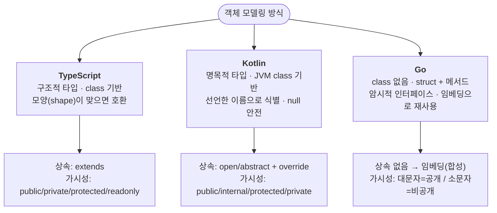
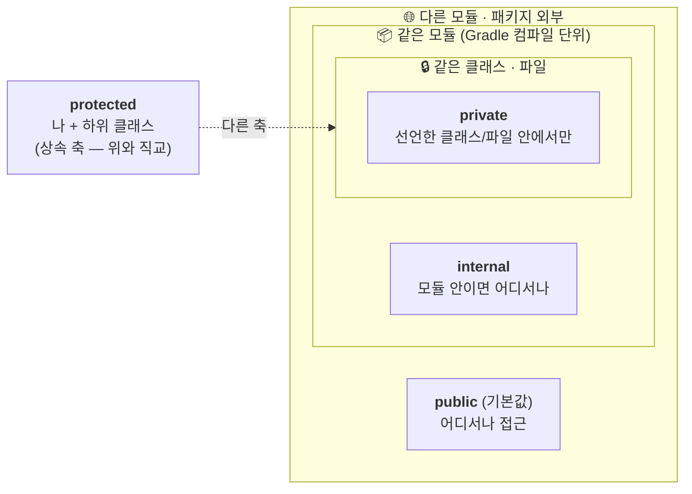
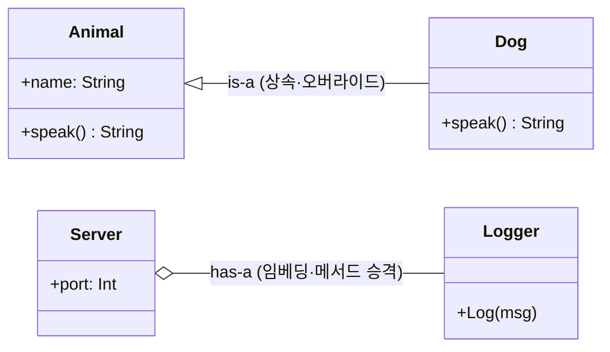
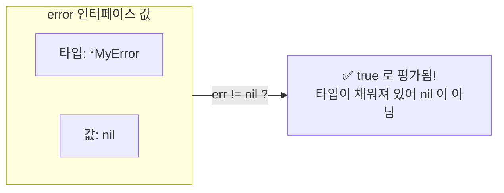
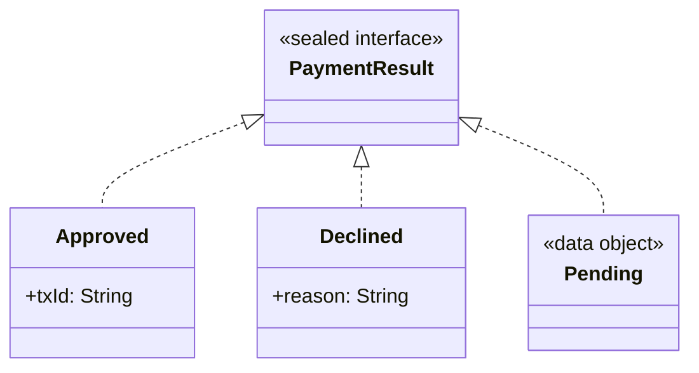

# 객체지향 모델링

TypeScript 개발자에게 Kotlin과 Go의 객체지향은 "같은 단어, 다른 규칙"입니다. `class`라는 키워드는 세 언어에 다 있는 것 같지만(Go에는 아예 없습니다), 타입을 식별하는 방식, 접근을 제어하는 축, 재사용을 얻는 수단이 모두 다릅니다. 이 문서는 여러 장에 흩어져 있던 클래스·가시성·상속·인터페이스·다형성 내용을 한곳에 모으고, JS/TS 개발자가 추측하기 어려운 지점을 채웁니다.

## 세 언어의 객체지향, 한눈에 보기

가장 먼저 잡아야 할 큰 그림은 **타입을 무엇으로 식별하는가**입니다.



| 관점 | TypeScript | Kotlin | Go |
| --- | --- | --- | --- |
| 타입 식별 | 구조적(Structural) — 모양이 같으면 같은 타입 | 명목적(Nominal) — 이름으로 식별, null 안전 | 명목적 + **암시적** 인터페이스 구현 |
| 클래스 | `class` | `class`(기본 `final`) | 없음 — `struct` + 메서드 |
| 상속 | `extends` / `implements` | `open`/`abstract` + `override` | **없음** — 임베딩·인터페이스로 대체 |
| 재사용 축 | 상속 + 합성 | 합성(위임 `by`) 권장 + 상속 | 오직 합성(임베딩) |
| 인터페이스 | 구조적, 선언 불필요 | **명시적** 구현 선언 | **암시적** — 시그니처만 맞으면 구현 |
| 다형성 | 프로토타입/가상 디스패치 | 가상 디스패치 + `sealed` 망라 검사 | 인터페이스 디스패치 + 타입 스위치 |

> 구조적 타입에서는 `UserId = string`과 `TenantId = string`이 서로 대입 가능하지만, Kotlin/Go의 명목 타입에서는 별개의 타입입니다. 이 차이는 [Types and Modeling](/guide/types-and-modeling) 문서에서 브랜디드 타입과 함께 더 다룹니다.

## 클래스와 생성자

세 언어의 "의존성을 받아 서비스를 만든다"는 가장 흔한 패턴을 나란히 보겠습니다.

```ts
// TypeScript — 생성자 파라미터 프로퍼티로 필드 선언 + 주입을 한 번에
class TenantService {
  constructor(private readonly repo: TenantRepository) {}
}
```

```kotlin
// Kotlin — 주 생성자(primary constructor)가 곧 필드 선언. @Autowired 불필요
@Service
class TenantService(
    private val tenantRepository: TenantRepository,
)
```

```go
// Go — class가 없다. struct로 상태를 묶고, New 함수가 생성자 역할을 한다
type Handler struct {
	sender Sender
	log    *slog.Logger
}

func New(sender Sender, logger *slog.Logger) *Handler {
	return &Handler{sender: sender, log: logger}
}
```

읽을 때의 감각:

- **Kotlin 주 생성자**는 클래스 헤더의 괄호 그 자체입니다. `private val x`는 "생성자로 받으면서 동시에 `x`라는 `private` 프로퍼티로 저장"을 뜻합니다. TS의 생성자 파라미터 프로퍼티(`private readonly`)와 정확히 대응합니다.
- **Go에는 생성자가 문법으로 없습니다.** 관례적으로 `New`로 시작하는 함수가 초기화된 포인터(`*Handler`)를 돌려줍니다. DI 프레임워크의 마법 대신 `New`가 의존성을 명시적으로 엮습니다.
- Kotlin의 **부 생성자**나 **private 생성자 + 팩토리**가 필요하면 `companion object`를 씁니다(아래 [데이터 모델링](#데이터-모델링-클래스) 참고).

```kotlin
// private 생성자 + companion object 팩토리 — 유효성 통과한 인스턴스만 만들도록 강제
class Tenant private constructor(val id: String) {
    companion object {
        fun of(raw: String): Tenant = Tenant(raw.trim())
    }
}
Tenant.of("acme")
```

## 접근 제어자: private / protected / internal

여기가 TS 개발자가 가장 자주 헷갈리는 지점입니다. **Kotlin의 `internal`은 TS의 `protected`가 아닙니다.** 접근 제어에는 서로 직교하는 두 개의 축이 있다는 것부터 잡아야 합니다.

- **수직 축(상속)**: 나 → 하위 클래스 → 외부. 이 축을 제어하는 것이 `protected`.
- **수평 축(모듈/패키지 경계)**: 같은 파일 → 같은 모듈 → 외부. 이 축을 제어하는 것이 `internal`.



### 세 언어 대응표

| 개념 | TypeScript | Kotlin | Go |
| --- | --- | --- | --- |
| 어디서나 | `public`(기본) | `public`(기본) | 대문자 시작 이름 (`Handler`, `Notify`) |
| 나 + 하위 클래스 | `protected` | `protected` | — (상속이 없어 개념 부재) |
| 같은 모듈/패키지 | — | **`internal`** | 소문자 시작 이름 (패키지 내부) |
| 나/파일만 | `private` | `private` | — (파일 단위 캡슐화는 소문자로) |
| 변경 불가 | `readonly` | `val` | 관례상 노출 안 함 + 게터 |

### Kotlin: `private` vs `internal` vs `protected`

```kotlin
private fun parse() {}          // 선언된 클래스/파일 안에서만
internal class DomainRule       // 같은 Gradle 모듈 안 어디서나 (다른 모듈에선 안 보임)
protected open fun hook() {}    // 나 + 하위 클래스에서만
class PublicService             // 기본 public — 어디서나
```

- **`private`**: 최상위(top-level)에 선언하면 *파일* 스코프, 클래스 멤버로 선언하면 *클래스* 스코프입니다. TS의 `private`(클래스 스코프)과 거의 같되, "파일 단위 private"이 추가로 가능하다는 점이 다릅니다.
- **`internal`**: **같은 컴파일 모듈(같은 Gradle 모듈/소스셋) 안에서만** 보입니다. 상속과 무관합니다. 이 모듈을 라이브러리로 의존하는 다른 모듈에서는 존재조차 보이지 않습니다.
- **`protected`**: 나와 하위 클래스에서만. TS `protected`와 동일합니다.

> [!TIP]
> **`internal`을 자주 만나는 이유는 테스트 때문입니다.** 외부 API는 아니지만 단위 테스트에서 직접 호출하고 싶은 내부 헬퍼를 `private` 대신 `internal`로 둡니다. 테스트 코드(`src/test`)는 같은 모듈이라 `internal` 멤버에 접근할 수 있고, 라이브러리 소비자에게는 여전히 숨겨집니다. "구현 세부지만 테스트는 하고 싶다"는 신호로 읽으면 됩니다.

### Go: 대소문자가 곧 접근 제어자

Go에는 키워드가 없습니다. **식별자 첫 글자의 대소문자**가 노출 여부를 결정합니다.

```go
func PublicFunction() {}   // 대문자 → 패키지 외부로 Exported (공개)
func privateFunction() {}  // 소문자 → 패키지 내부로만 (unexported)

type Handler struct {}     // 공개 타입
type sender interface {}   // 패키지 내부 인터페이스
```

- 대문자 = 패키지 밖에서 임포트 가능(Exported), 소문자 = 패키지 내부 전용. Kotlin의 `public`/`internal`과 결이 비슷하지만 경계 단위가 **패키지**입니다.
- `internal/` **디렉터리** 규칙: `internal/` 아래 패키지는 모듈 외부에서 임포트할 수 없습니다. 강한 캡슐화 경계입니다.
- **직렬화에 직결됩니다**: 소문자(비노출) struct 필드는 `encoding/json`이 무시합니다. JSON에 안 나오는 필드가 있다면 필드명 첫 글자 대소문자를 먼저 확인하세요.

> [!NOTE]
> 리뷰 관점: Kotlin에서 외부에 굳이 열 필요 없는 헬퍼가 기본 `public`으로 방치돼 있지 않은지, Go에서 불필요하게 대문자로 노출되어 패키지 결합면을 넓히고 있지 않은지 살핍니다. 엔티티의 가변 상태 필드가 서비스 계층 밖으로 열려 있으면(무분별한 setter) 접근 범위를 좁히고 의도가 담긴 행위 메서드로 바꾸는 것이 좋습니다.

## 상속 vs 합성

TS는 `extends`로 상속을 자연스럽게 쓰지만, Kotlin은 상속을 신중하게(기본 `final`) 다루고, **Go에는 상속이 아예 없습니다.** 재사용은 대부분 합성으로 풉니다.



### Kotlin: 상속은 명시적으로 열어야 한다

Java와 달리 Kotlin 클래스와 메서드는 **기본이 `final`**입니다. 상속·오버라이드를 허용하려면 `open`을, 아예 구현을 강제하려면 `abstract`를 명시해야 합니다.

```kotlin
// 상속을 의도한 클래스만 open. 하위에서 재정의할 멤버도 open 이어야 한다
abstract class Shape {
    abstract fun area(): Double        // 구현 없음 → 하위가 반드시 구현
    open fun describe(): String = "도형" // 기본 구현 제공, 재정의 허용
}

class Circle(val radius: Double) : Shape() {
    override fun area(): Double = Math.PI * radius * radius
    override fun describe(): String = "반지름 $radius 원"
}
```

- `: Shape()` — 상속 시 부모 생성자를 **호출**합니다(괄호). 인터페이스 구현에는 괄호가 없습니다.
- `override`는 **필수 키워드**입니다(TS 4.3+의 선택적 `override`와 달리 생략 불가). 부모에 없는 메서드에 `override`를 붙이면 컴파일 에러라, 오타로 인한 "오버라이드한 줄 알았는데 새 메서드" 버그를 막아줍니다.

### Go: 상속이 없다 — 임베딩은 "is-a"가 아니라 "has-a"

```go
type Logger struct{ prefix string }
func (l Logger) Log(msg string) { fmt.Println(l.prefix, msg) }

type Server struct {
    Logger      // 임베디드 필드 (필드명이 없다)
    port int
}

s := Server{Logger: Logger{prefix: "[srv]"}, port: 8080}
s.Log("started") // Logger.Log 가 승격되어 s.Log 로 바로 호출됨
```

> [!WARNING]
> **임베딩을 상속으로 오해하지 마세요.** 임베딩은 "is-a"가 아니라 "has-a + 메서드 승격"입니다. 가상 디스패치가 없어서, 임베딩된 `Logger.Log`는 자신을 품은 `Server`를 전혀 알지 못합니다. 상속처럼 하위에서 동작을 "오버라이드"하면 부모 메서드가 그걸 호출해 줄 거라 기대한 코드가 있다면 버그입니다. 다형성이 필요하면 **인터페이스로** 풀어야 합니다. 또한 바깥 struct에 같은 이름의 필드/메서드가 있으면 임베딩된 쪽을 가립니다(shadowing).

### Kotlin: 위임(`by`)으로 합성하기

Kotlin은 상속 대신 **클래스 위임**으로 "인터페이스 구현을 멤버 객체에게 통째로 떠넘기고, 필요한 것만 오버라이드"하는 합성을 문법으로 지원합니다.

```kotlin
// MutableList 구현을 inner 에게 위임하고, add 만 가로채 로깅 (상속 대신 조합)
class LoggingList<T>(private val inner: MutableList<T>) : MutableList<T> by inner {
    override fun add(element: T): Boolean {
        log.info("add $element")
        return inner.add(element)
    }
}
```

> [!NOTE]
> 리뷰 관점: `by inner`는 오버라이드하지 않은 **모든** 메서드를 inner로 그대로 전달합니다. 로깅/검증 래퍼를 만들었는데 `add`만 가로채고 `addAll`은 위임돼 우회되는 식의 구멍이 없는지 확인하세요.

## 인터페이스

인터페이스는 세 언어에서 "구현을 선언하는 방식"이 가장 크게 갈립니다.

- **TypeScript**: 구조적. `implements`는 선택이며, 모양만 맞으면 구현으로 취급됩니다.
- **Kotlin**: 명시적. `class Foo : Bar`처럼 구현을 **선언**해야 합니다.
- **Go**: 암시적. 인터페이스 이름을 어디에도 적지 않고, 시그니처만 동일하게 구현하면 자동으로 그 인터페이스로 취급됩니다.

```go
// Go — 구현을 선언하지 않는다. Read 메서드만 있으면 io.Reader "이다"
type Reader interface {
    Read(p []byte) (n int, err error)
}
// File 에 Read(p []byte) (int, error) 가 있으면, File 은 자동으로 Reader
```

```kotlin
// Kotlin — 익명 구현(object 표현식). override 필수
val comparator = object : Comparator<Int> {
    override fun compare(a: Int, b: Int) = a - b
}
```

Go 인터페이스는 **작게, 소비자 쪽에서** 정의하는 것이 관례입니다(메서드 1~2개). 제공자 패키지가 거대한 다목적 인터페이스를 미리 export 하는 것은 과한 추상화 신호입니다.

### Go의 typed-nil 함정

인터페이스 값은 내부적으로 **`(타입, 값)` 쌍**입니다. 타입 정보가 채워져 있으면 값이 `nil`이어도 인터페이스 자체는 `!= nil`이 됩니다.



```go
func doWork() error {
    var e *MyError = nil // 구체 타입 포인터, 값은 nil
    return e             // error 인터페이스로 반환 → (타입=*MyError, 값=nil)
}

func main() {
    if err := doWork(); err != nil {
        // 여기 들어온다! err 는 타입(*MyError)이 있어 nil 이 아님 — 예상과 반대
    }
}
```

> [!WARNING]
> 성공 시에는 항상 `return nil`(리터럴)을 반환하고, 에러 변수는 구체 포인터 타입이 아니라 **인터페이스 타입(`error`)으로 선언**하세요. `var err error`로 두면 typed-nil 오탐을 피할 수 있습니다.

## 다형성과 봉인된 계층

### Kotlin: sealed 계층 + when 망라 검사

`sealed`는 "이 인터페이스/클래스를 구현하는 타입은 여기 나열된 것이 전부"라고 컴파일러에게 약속합니다. TS의 판별 유니온(discriminated union)에 대응하지만, **망라성(exhaustiveness)을 컴파일러가 강제**한다는 점이 핵심입니다.



```kotlin
sealed interface PaymentResult {
    data class Approved(val txId: String) : PaymentResult
    data class Declined(val reason: String) : PaymentResult
    data object Pending : PaymentResult
}

fun handle(result: PaymentResult): String = when (result) {
    is PaymentResult.Approved -> "승인: ${result.txId}"   // 여기서 result 가 Approved 로 스마트 캐스트
    is PaymentResult.Declined -> "거절: ${result.reason}"
    PaymentResult.Pending -> "대기 중"
    // else 가 필요 없다. 하위 타입이 새로 생기면 이 when 이 컴파일 에러로 누락을 알려준다
}
```

> [!TIP]
> `sealed`/`enum`을 분기하는 `when`에 방어적으로 `else -> throw ...`를 붙이지 마세요. `else`가 있으면 하위 타입이 추가돼도 컴파일러가 경고하지 못해, 망라 검사의 이점을 스스로 없애는 셈입니다.

### Go: 타입 스위치

Go는 sealed가 없으므로 `any`/인터페이스 값을 **타입 스위치**로 분기합니다.

```go
// 타입 단언 — 반드시 comma-ok 형태로 안전하게
if s, ok := val.(string); ok {
    use(s)          // val 이 string 일 때만
}
n := val.(int)      // ok 없이 쓰면 실패 시 panic — 외부 입력엔 금지

// 타입 스위치 — 여러 구체 타입 분기
switch v := val.(type) {
case string:
    fmt.Println("string", len(v))
case int, int64:
    fmt.Println("integer")
case nil:
    fmt.Println("nil")
default:
    fmt.Printf("unknown %T\n", v)
}
```

> [!NOTE]
> `any`에 대한 거대한 타입 스위치가 여기저기 반복된다면 설계 냄새입니다. 인터페이스 메서드나 제네릭으로 다형성을 표현하는 편이 낫습니다.

### 정적 디스패치 주의: 확장 함수

Kotlin의 **확장 함수는 다형성이 없습니다.** 선언된 정적 타입 기준으로 결정(정적 디스패치)되므로, 오버라이드처럼 동작할 거라 기대하면 안 됩니다.

```kotlin
// String 에 메서드를 붙인 것처럼 보이지만, 실제로는 정적 함수의 문법 설탕
fun String.toSlug(): String = trim().lowercase().replace(" ", "-")
"Hello World".toSlug() // "hello-world"
```

## 데이터 모델링 클래스

값을 담는 타입을 만드는 관용구입니다. 자세한 타입 설계는 [Types and Modeling](/guide/types-and-modeling)에서 다루고, 여기서는 OOP 관점의 요점만 모읍니다.

### Kotlin data class

```kotlin
data class TokenResponse(
    val accessToken: String,
    val expiresIn: Long,
)
```

컴파일러가 `equals()`/`hashCode()`/`toString()`/`copy()`/구조 분해를 자동 생성합니다. 불변 DTO에 이상적입니다.

> [!WARNING]
> **JPA 엔티티에는 `data class`를 쓰지 마세요.** 자동 생성된 `equals/hashCode`가 엔티티의 식별자 기반 동등성, 지연 로딩 프록시, 가변 생명주기와 충돌합니다. 또한 `toString()`이 토큰·PII를 로그로 흘릴 수 있으니 민감 필드가 있는 data class는 주의하세요.

### 일반 class vs data class — `==`와 `===`

```kotlin
val a = Money(100)
val b = Money(100)
a == b   // true  — 값이 같음 (data class 의 equals)
a === b  // false — 서로 다른 인스턴스(참조)
```

일반 `class`(data 아님)는 참조 기반 `equals()`라, `==`가 참조 비교가 됩니다. 값 동등성이 필요하면 `data class`이거나 `equals`를 직접 구현해야 합니다. (TS의 `===`는 원시값=값비교/객체=참조비교라 의미가 다릅니다.)

### object와 companion object — Kotlin에는 static이 없다

```kotlin
// object 선언: 그 자체로 스레드 안전한 싱글톤
object FeatureFlags {
    val betaEnabled = true
}
FeatureFlags.betaEnabled // 인스턴스 생성 없이 접근

// companion object: 클래스에 종속된 "정적" 멤버 / 팩토리
class Tenant private constructor(val id: String) {
    companion object {
        fun of(raw: String): Tenant = Tenant(raw.trim())
    }
}
```

> [!NOTE]
> 리뷰 관점: `object`나 `companion object`에 가변 `var` 상태가 있으면 전역 공유 상태라 경합 위험이 있습니다. 또한 `companion object` 팩토리가 의존성을 직접 `new` 하면 DI/테스트 용이성을 깨뜨립니다.

### 열거형: Kotlin enum class vs Go iota

```kotlin
// Kotlin — 각 상수가 타입 안전한 인스턴스. when 에서 망라 검사 가능
enum class Role { ADMIN, MEMBER, GUEST }
val role: Role = Role.MEMBER
```

```go
// Go — enum 이 없다. iota 로 연속 상수를 만들고 Stringer 로 이름을 붙인다
type Status int

const (
    Pending Status = iota // 0
    Active                // 1 (표현식이 반복되며 iota 자동 증가)
    Closed                // 2
)

func (s Status) String() string { // 로그·JSON 가독성 확보
    return [...]string{"pending", "active", "closed"}[s]
}
```

> [!WARNING]
> Go의 iota 열거형은 **제로 값이 첫 상수(`Pending`)** 입니다. "미설정"과 구분해야 하면 `Unknown Status = iota`를 0번에 두세요. 또 `Status(99)`처럼 범위를 벗어난 값도 컴파일러가 막지 못하므로, 외부에서 들어온 정수는 반드시 검증해야 합니다.

### 값 클래스 / 명명 타입 — 원시 타입 강박 줄이기

```ts
type UserId = string;   // TS: 구조적이라 TenantId 와 섞여도 컴파일 통과 (브랜딩 필요)
```

```kotlin
@JvmInline
value class UserId(val value: String) // 런타임 오버헤드 없이 명목 타입
```

```go
type UserID string  // Go: 명명 타입 → string 과 구별되는 별개 타입
```

Kotlin/Go는 명목 타입이라 `UserId`와 `TenantId`를 섞으면 컴파일 에러입니다. TS는 구조적이라 이 안전성을 얻으려면 브랜디드 타입이 필요합니다.

## 리뷰 체크리스트

한눈에 보는 언어별 점검 포인트입니다.

| 항목 | 무엇을 볼까 |
| --- | --- |
| Kotlin 가시성 | 외부에 열 필요 없는 헬퍼가 기본 `public`으로 방치돼 있지 않은가. 테스트 목적의 `internal`이 실제로 그 모듈에서만 쓰이는가 |
| Kotlin `internal` vs `protected` | 모듈 경계(수평)와 상속 경계(수직)를 혼동하지 않았는가 |
| Kotlin 상속 | `open`을 꼭 필요한 곳에만 열었는가. `override` 누락/오용은 없는가. 상속보다 위임(`by`)이 맞는 상황은 아닌가 |
| Kotlin sealed/when | 방어적 `else`로 망라 검사를 무력화하지 않았는가 |
| Go 가시성 | 불필요한 대문자 노출로 패키지 결합이 넓어지지 않았는가. JSON에 안 나오는 필드가 소문자 때문은 아닌가 |
| Go 임베딩 | 상속처럼 오버라이드를 기대하고 있지 않은가(가상 디스패치 없음). 다형성이 필요하면 인터페이스로 풀었는가 |
| Go 인터페이스 | 작게, 소비자 쪽에서 정의했는가. typed-nil 오탐 가능성은 없는가(성공 시 `return nil`) |
| Go 리시버 | 상태를 바꾸거나 큰 struct면 포인터 리시버(`*T`), 작고 불변이면 값 리시버(`T`)를 일관되게 골랐는가 |
| 데이터 모델 | JPA 엔티티에 `data class`를 쓰지 않았는가. `toString()`이 민감정보를 흘리지 않는가. iota 제로 값/범위를 검증하는가 |
