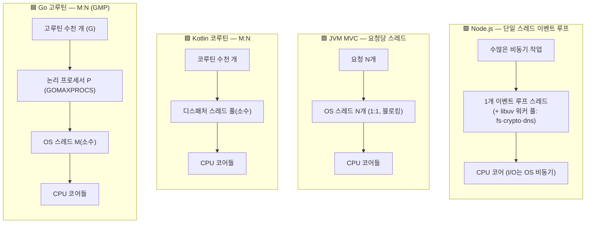
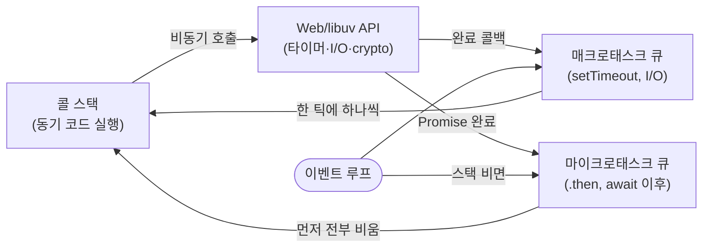
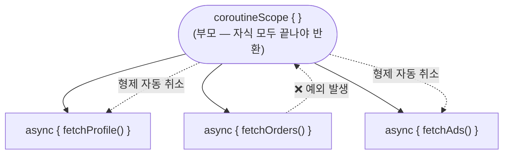
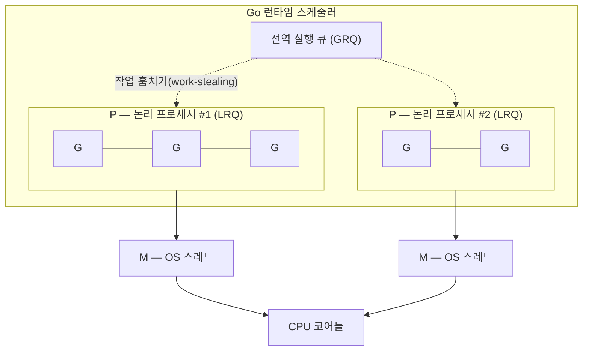
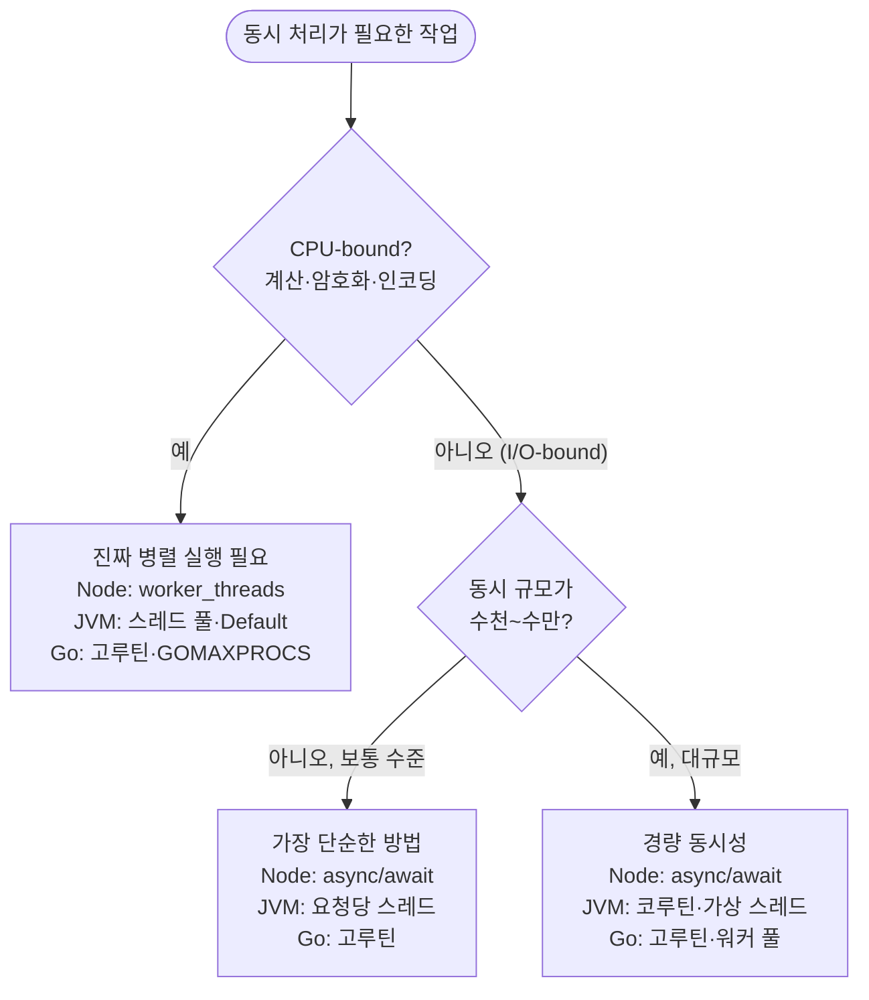

# Async and Concurrency

## 동시성 ≠ 병렬성, 그리고 세 런타임

먼저 용어를 못 박고 가겠습니다. **동시성(Concurrency)** 은 여러 작업을 "번갈아 다루는" 구조의 문제이고, **병렬성(Parallelism)** 은 여러 작업을 "물리적으로 동시에 실행"하는 것입니다. Rob Pike의 유명한 정의대로 — *동시성은 많은 일을 다루는 것(dealing with), 병렬성은 많은 일을 동시에 하는 것(doing)* 입니다. 싱글 코어에서도 동시성은 가능하지만, 병렬성은 코어가 여러 개여야 가능합니다.

이 구분이 중요한 이유는 **각 런타임이 작업을 OS 스레드에 매핑하는 방식**이 다르기 때문입니다.



| | Node.js | JVM/Spring MVC | Kotlin 코루틴 | Go 고루틴 |
| --- | --- | --- | --- | --- |
| 작업→스레드 매핑 | 다수 → **1** 루프 | 요청 1 → **1** 스레드 | 다수 → 소수 (M:N) | 다수 → 소수 (M:N) |
| 동시성 | 이벤트 루프 | 스레드 다중화 | 서스펜션 | 고루틴 |
| 병렬성 | ❌ 기본 불가 (`worker_threads` 필요) | ✅ 스레드 수만큼 | ✅ 디스패처 풀 | ✅ `GOMAXPROCS`만큼 |
| 취소/생명주기 | `AbortController` | 스레드/트랜잭션 | 구조화된 동시성 | `context.Context` |
| 블로킹의 대가 | 루프 전체 정지 | 스레드 1개 점유 | 디스패처 스레드 1개 점유 | M 1개 점유(런타임이 보충) |

> [!NOTE]
> 핵심 통찰: **Node의 `async/await`는 병렬 실행이 아니라 "대기 시간 겹치기"** 입니다. CPU를 오래 쓰는 작업은 `await`을 붙여도 루프를 막습니다. 반면 코루틴/고루틴은 스레드 풀 위에서 진짜 병렬로도 돌 수 있습니다.

## 실행 모델 뜯어보기

### Node.js: 단일 스레드 이벤트 루프

Node의 설계 목표는 **하나뿐인 이벤트 루프 스레드가 블로킹 연산으로 멈추지 않게** 하는 것입니다. `await`은 스레드를 새로 만드는 게 아니라, 대기 중인 작업을 큐에 넘기고 루프에 제어권을 돌려줍니다.



```ts
const a = await fetchA();
const [b, c] = await Promise.all([fetchB(), fetchC()]); // 동시 시작, 함께 대기
```

리뷰 포인트: "어느 작업이 상호 의존 없이 동시에 실행될 수 있는가", "하나의 실패가 파이프라인 전체로 어떻게 번지는가(Unhandled Rejection 방지)", "네트워크 지연 시 취소·타임아웃 장치(`AbortController`, `Promise.race`)가 있는가".

### JVM/Spring MVC: 요청당 스레드(Thread-per-request)

대부분의 Kotlin 서버는 Spring MVC + JDBC/JPA의 **멀티 스레드 블로킹** 아키텍처에서 기동됩니다. `async/await` 감각보다 **DB 트랜잭션과 스레드의 관계**가 핵심입니다.

- **스레드 당 요청**: 인바운드 HTTP 요청 하나당 WAS 워커 스레드 하나가 배정되어 동기적으로 블로킹 I/O를 수행합니다(Tomcat 기본 풀 ~200).
- **스레드 로컬과 트랜잭션 경계**: Spring의 트랜잭션 컨텍스트는 스레드 로컬에 결합되어 생명주기가 관리됩니다.
- **트랜잭션 내부의 무거운 I/O 금지**: `@Transactional` 안에서 외부 HTTP/알림/메일 같은 지연 작업을 호출하면, 응답을 기다리는 동안 DB 커넥션과 로우 락을 과도하게 오래 점유해 커넥션 고갈·스레드 마비를 부릅니다.

> [!TIP]
> Java 21의 **가상 스레드(Virtual Threads, JEP 444)** 는 "요청당 스레드"의 단순함을 유지하면서 스레드 고갈 문제를 완화합니다. 블로킹 코드를 그대로 두고도 수만 동시 요청을 감당하게 해주므로, 신규 스택이라면 코루틴 도입 전에 먼저 검토할 선택지입니다.

### Kotlin 코루틴: 구조화된 동시성(Structured Concurrency)

코루틴은 OS 스레드 수준의 컨텍스트 스위칭 비용 없이 협력적 멀티태스킹을 가능하게 합니다. 가장 큰 특징은 **구조화된 동시성** — 모든 코루틴은 부모 스코프에 속하고, 부모는 자식이 모두 끝나야 종료되며, 하나가 실패하면 형제가 함께 취소됩니다.



```kotlin
suspend fun loadDashboard(userId: String): Dashboard = coroutineScope {
    val profile = async { fetchProfile(userId) } // 동시 시작 (Deferred 반환)
    val orders = async { fetchOrders(userId) }
    Dashboard(profile.await(), orders.await())    // 두 결과를 모두 대기
}
```

`async`는 결과를 담는 `Deferred`를 즉시 반환하고 `await()`에서 값을 회수합니다. 여러 결과를 한꺼번에 모을 땐 `listOf(...).awaitAll()`을 씁니다. 하나라도 실패하면 나머지 형제가 취소되는 것이 구조화된 동시성의 경계입니다. (`suspend`/`async` 문법이 낯설면 [Kotlin Idioms](/guide/kotlin-idioms)를 함께 보세요.)

리뷰 포인트:

- **코루틴 내 블로킹 호출 식별**: `suspend` 블록에서 블로킹 JDBC나 기존 블로킹 API를 그냥 호출하면 디스패처 스레드를 점유합니다. 불가피하면 `withContext(Dispatchers.IO) { ... }`로 명시 격리했는지 확인합니다.
- **취소 전파 안정성**: 부모가 닫히거나 예외 발생 시 하위 태스크가 누수 없이 함께 취소되는지, 특히 취소 시점의 비즈니스 트랜잭션이 롤백을 정상 수반하는지 점검합니다.

### Go 고루틴: M:N 스케줄러(GMP)

Go 런타임은 고루틴을 **자체 스케줄링**합니다. 수천 개 고루틴을 띄워도, 런타임이 이들을 소수의 OS 스레드에 다중화합니다. 이 모델을 흔히 GMP라 부릅니다.



`G`(goroutine)는 실행 단위, `P`(processor)는 `GOMAXPROCS` 개수만큼 있는 논리 프로세서(각자 로컬 큐 LRQ 보유), `M`(machine)은 실제 OS 스레드입니다. 고루틴이 블로킹되면 런타임이 M을 떼어내 다른 고루틴을 태웁니다.

```go
go func() {
	if err := srv.ListenAndServe(); err != nil {
		serverErr <- err
	}
}()
```

여러 작업을 병렬 처리하고 모두 기다리는 것(`Promise.all`에 해당)은 `sync.WaitGroup` 또는 `golang.org/x/sync/errgroup`으로 표현합니다. `errgroup`은 첫 에러를 수집하고 컨텍스트를 취소해 준다는 점에서 더 안전합니다.

```go
g, ctx := errgroup.WithContext(ctx)
for _, id := range ids {
	g.Go(func() error {
		return process(ctx, id) // 하나라도 에러면 ctx가 취소되어 나머지도 중단
	})
}
if err := g.Wait(); err != nil { // 모든 고루틴 완료 대기 + 첫 에러 반환
	return err
}
```

리뷰 포인트:

- **고루틴 누수(Goroutine Leak) 방지**: 조건 불만족으로 영구히 종료되지 않는 좀비 고루틴이 없는지, 상위 컨텍스트 취소·타임아웃 시 내부 루프도 즉시 중단되도록 가드가 있는지 확인합니다.
- **채널 데드락 제어**: 수신자가 없거나 버퍼가 가득 차 송신부가 영구 차단되는 교착 가능성을, 채널 버퍼 크기와 클로즈 수명 주기로 점검합니다.

> [!NOTE]
> **머신당 동시성의 실전 임팩트** — 고루틴의 "저렴한 동시성"이 규모에서 무엇을 바꾸는지는 최근 대형 서비스들이 Python/Node.js 백엔드를 Go로 옮긴 사례에서 드러납니다. 아래는 각 회사의 공식 엔지니어링 기록에 근거한 수치입니다.
>
> - **Reddit** — 코어 도메인(Comments·Accounts·Posts·Subreddits) 중 **댓글 백엔드**를 Go 마이크로서비스로 이전. 반복되던 신뢰성·성능 저하와 불명확한 코드 소유권이 동기였고, 이관한 세 write 엔드포인트(생성·수정·증가)의 P99 레이턴시가 절반으로 감소 — 레거시 Python이 겪던 최대 15초의 지연 스파이크를 걷어냈습니다. ([Reddit Eng](https://www.reddit.com/r/RedditEng/comments/1mbqto6/modernizing_reddits_comment_backend_infrastructure/))
> - **Lovable** — 한 번의 채팅 요청이 50개 이상의 HTTP 콜을 동시에 날리는 고동시성 워크로드. Python 약 4.2만 줄을 Go로 재작성한 뒤 서버 인스턴스 200개 → 10개, 배포 15분 → 3분, 평균 요청 약 12% 단축. ([Lovable Blog](https://lovable.dev/blog/from-python-to-go))
> - **Uber** — 대규모 서비스(청구서 생성)를 Python에서 Go로 이전. "같은 트래픽을 처리하면서 수백 대의 노드를 반납"해 해당 서비스의 컴퓨트 요구량을 약 97% 절감했고, 엔지니어의 지원 업무 비중이 60% → 20% 미만으로 줄었습니다. 사내에서 "Python은 더 이상 백엔드 지원 언어가 아니다"라는 방침이 전환의 계기였습니다. ([Uber Eng](https://www.uber.com/blog/the-perils-of-migrating-a-large-scale-service-at-uber/))
>
> 공통 동인은 성능 그 자체가 아니라 **머신당 동시 처리량(concurrency per machine)** 입니다. 앞서 본 요청당 스레드(thread-per-request) 모델이나 단일 스레드 이벤트 루프가 감당하던 부하를, 고루틴은 훨씬 적은 자원으로 소화합니다. 다만 리뷰어 관점에서 이 이점은 앞서 짚은 **고루틴 누수·컨텍스트 취소·채널 데드락**을 제대로 통제했을 때에만 유지된다는 점을 기억하세요. (네 사례의 종합 개관: [The Real Reason Big Tech Is Switching to Go](https://www.youtube.com/watch?v=-Z813pHqSFI))

## 병렬 실행 패턴 매핑

같은 "동시에 시작하고 모두 기다리기"가 언어마다 어떻게 표현되는지 대응시켜 두면 리뷰가 빨라집니다.

| 의도 | TypeScript | Kotlin | Go |
| --- | --- | --- | --- |
| 동시 시작 + 모두 대기 | `Promise.all([...])` | `awaitAll()` / `async`+`await` | `errgroup` / `WaitGroup` |
| 먼저 끝난 하나 | `Promise.race([...])` | `select { }` | `select { }` (채널) |
| 하나 실패 시 나머지 취소 | `Promise.all`(reject 전파) | `coroutineScope`(형제 취소) | `errgroup.WithContext` |
| 실패 격리(전부 수집) | `Promise.allSettled` | `supervisorScope` | 개별 에러 수집 |
| 취소/타임아웃 | `AbortController` | `withTimeout` | `context.WithTimeout` |

## 언제 무엇을 쓰는가 (그리고 쓰지 말아야 할 때)

도구 선택의 첫 질문은 **CPU-bound냐 I/O-bound냐**, 그다음이 **동시성 규모**입니다.



### Node.js `async/await`

- ✅ **적합**: DB·HTTP·파일 등 I/O-bound, 다수 동시 연결, 이벤트 기반 파이프라인.
- ❌ **부적합**: CPU-bound(암호화, 이미지 처리, 큰 `JSON.parse`, 취약 정규식). 이벤트 루프를 막아 *모든* 요청이 멈춥니다 → `worker_threads`·별도 프로세스·네이티브 애드온으로 분리.

### JVM 요청당 스레드(블로킹)

- ✅ **적합**: 전통적 CRUD, JDBC/JPA 블로킹 스택, 중간 규모 동시성, "단순함"이 최고 가치일 때.
- ❌ **부적합**: 수만 동시 느린 I/O(스레드 풀 고갈), fan-out이 큰 외부 호출. → 코루틴, WebFlux, 또는 **가상 스레드(Java 21)**.

### Kotlin 코루틴

- ✅ **적합**: 많은 동시 `suspend` I/O, fan-out/fan-in, 구조화된 취소·타임아웃, WebFlux·Ktor 비동기 스택.
- ❌ **부적합/주의**: ① `suspend`에서 블로킹 JDBC 직접 호출(→ `Dispatchers.IO` 격리 필수). ② `@Transactional`의 스레드 로컬은 디스패처가 스레드를 바꾸면 깨질 수 있음 — MVC 블로킹 스택에 코루틴을 억지로 얹는 것은 흔한 안티패턴. ③ 순수 CPU 병렬 계산만 필요하면 코루틴의 서스펜션 이점은 크지 않음(그냥 스레드 풀/`Default` 디스패처).

### Go 고루틴

- ✅ **적합**: 고동시성 I/O 서버, 파이프라인, 팬아웃, 채널 기반 조율, 백그라운드 작업. CPU 병렬성도 함께 얻음(`GOMAXPROCS`).
- ❌ **부적합/주의**: ① **무한정 스폰** 금지 — 요청마다 제한 없이 `go`를 뿌리면 메모리·스케줄러 압박·누수 → 워커 풀이나 세마포어(`golang.org/x/sync/semaphore`)로 상한. ② 단순 순차 작업에 불필요한 고루틴은 복잡도만 키움. ③ 공유 상태 뮤텍스 남발보다 "채널로 소통"이 Go다운 방향.

## Spring 트랜잭션과 스레드

`@Transactional` 환경의 리뷰 기준을 다시 정리합니다.

- **조회/수정 트랜잭션 분리**: 읽기 위주 유스케이스에 `@Transactional(readOnly = true)`를 적용해 커넥션 낭비를 줄이고 Read Replica 라우팅을 최적화했는지.
- **비즈니스 트랜잭션 범위 최소화**: PG 호출·메일링 등 지연 큰 외부 호출을 트랜잭션 밖으로 격리(비동기 이벤트/트랜잭션 전후 처리기)했는지.
- **동시 요청 제어와 멱등성**: 중복 유입 시 정합성 충돌을 막는 락 타임아웃, 분산 락, 멱등성 키 검증이 있는지.

## Go 컨텍스트(Context)

`context.Context`는 요청 취소 신호, 처리 기한(Deadline), 추적 메타데이터를 전파하는 핵심 매개체입니다.

```go
res, err := sender.Send(r.Context(), tokens, notification)
```

리뷰 포인트:

- **I/O 경계까지 ctx 연계**: HTTP 핸들러·DB 연결 등 모든 외부 I/O 함수 인자로 호출 스택 최하단까지 `ctx`가 끊김 없이 전달되는지.
- **자원 해제 보장**: `context.WithTimeout`/`WithCancel`의 `cancel`을 `defer cancel()`로 종료부에서 지연 실행하는지.
- **멤버 필드 보관 금지**: `Context`를 구조체 필드로 영속화하지 않고, 매 함수의 첫 인자(`func Do(ctx context.Context, ...)`)로 전달하는지.
- **`WithValue` 오용 차단**: 인증 메타데이터·트레이싱 ID 등 공통 데이터에만 아껴 쓰고, 비즈니스 모듈·싱글톤을 컨텍스트 뒤로 숨기는 DI 우회로 오용하지 않는지.

## 리뷰 체크리스트

| 대상 | 볼 것 |
| --- | --- |
| Node | CPU-bound가 루프를 막지 않는가(worker로 분리). Unhandled Rejection·타임아웃 처리가 있는가 |
| Spring tx | `@Transactional` 안에 무거운 외부 I/O가 없는가. readOnly 분리·멱등성 보장 |
| 코루틴 | `suspend`에서 블로킹 호출을 `Dispatchers.IO`로 격리했는가. 취소 시 롤백·자원 해제가 되는가 |
| 고루틴 | 누수 가드(ctx 취소)와 스폰 상한(워커 풀)이 있는가. 채널 데드락 여지가 없는가 |
| 공통 | 취소/타임아웃이 호출 스택 끝까지 전파되는가. 실패 전파 vs 실패 격리를 의도대로 선택했는가 |

## 더 깊이 보기

동시성은 짧은 요약으로 감을 잡고, 아래 자료로 모델을 몸에 익히는 것을 추천합니다.

**이벤트 루프 / Node.js**
- 🎥 Philip Roberts, *"What the heck is the event loop anyway?"* (JSConf EU 2014) — 콜 스택·큐·루프를 시각화한 입문 명강의. <https://2014.jsconf.eu/speakers/philip-roberts-what-the-heck-is-the-event-loop-anyway.html>
- 📄 Node.js 공식, *"Don't Block the Event Loop (or the Worker Pool)"* — 무엇이 루프를 막고 어떻게 피하는가. <https://nodejs.org/learn/asynchronous-work/dont-block-the-event-loop>

**동시성 vs 병렬성 / Go**
- 🎥 Rob Pike, *"Concurrency is not Parallelism"* (Waza 2012) — 이 문서 첫 절의 출처. <https://go.dev/blog/waza-talk> (영상: <https://vimeo.com/49718712>)
- 📄 Ardan Labs(Bill Kennedy), *"Scheduling In Go"* 3부작 — GMP 스케줄러를 밑바닥부터. [Part I(OS)](https://www.ardanlabs.com/blog/2018/08/scheduling-in-go-part1.html) · [Part II(Go)](https://www.ardanlabs.com/blog/2018/08/scheduling-in-go-part2.html) · [Part III(Concurrency)](https://www.ardanlabs.com/blog/2018/12/scheduling-in-go-part3.html)
- 📄 The Go Blog, *"Go Concurrency Patterns: Context"* — ctx 취소·전파 관용구. <https://go.dev/blog/context>

**코루틴 / JVM**
- 📄 Roman Elizarov, *"Structured concurrency"* — 구조화된 동시성의 철학과 설계(코루틴 리드가 직접). <https://elizarov.medium.com/structured-concurrency-722d765aa952>
- 🎥 Roman Elizarov, *"Deep Dive into Coroutines on JVM"* (KotlinConf 2017) — 서스펜션이 바이트코드로 어떻게 구현되는가. <https://www.youtube.com/watch?v=YrrUCSi72E8>
- 📄 Kotlin 공식 *Coroutines guide* — 실습형 레퍼런스. <https://kotlinlang.org/docs/coroutines-guide.html>
- 📄 *JEP 444: Virtual Threads* — "요청당 스레드"를 유지하며 확장하는 Java 21 접근. <https://openjdk.org/jeps/444>
